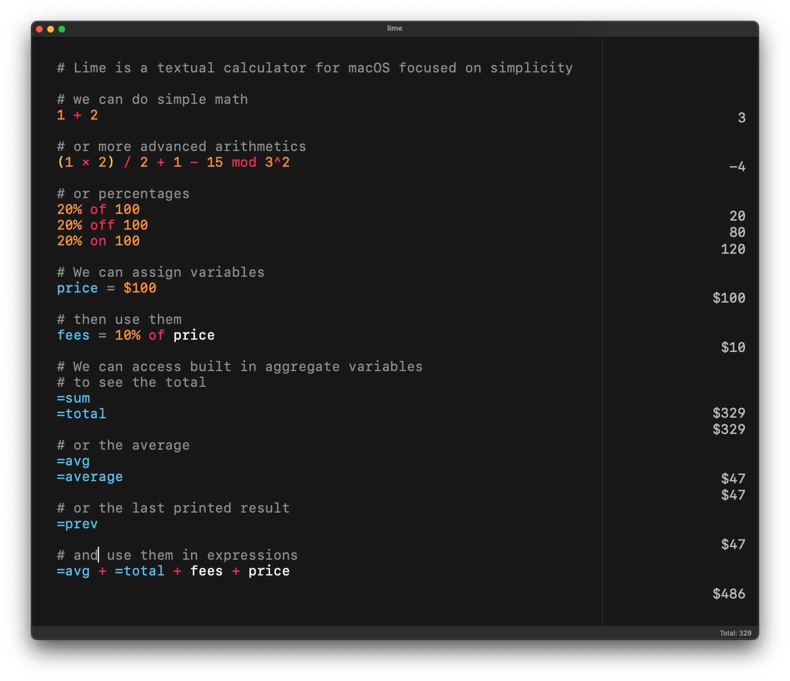

# Lime

A simple notepad-style calculator for macOS. Type on the left, see results on the right.



## Features

- Text editor interface with line-by-line evaluation
- Variables (`x = 5`) and reusable expressions
- Aggregate lines: `=sum`, `=total`, `=avg` / `=average`, `=prev`
- Currency support (`$`, `€`, `£`, `¥`)
- Percentages (`200 + 10%`, `50% of 80`)
- Modulo via `mod` (e.g. `10 mod 3`)
- Comments with `#`
- Running total in the status bar
- Native tabbed windows
- Minimal UI with syntax highlighting

## Examples

```text
# basic math
2 + 2
10 * 3
(5 + 3) ^ 2

# variables
x = 5
y = x * 10
y + 3

# currency
$10 + $15.50
€30 * 1.19

# percentages
200 + 10%
200 - 15%

# modulo
10 mod 3

# aggregates
10
20
30
=sum       # 60
=avg       # 20
=prev + 5  # 35
```

## Requirements

- macOS 14+
- Xcode 15+

## Building

1. Open `lime.xcodeproj` in Xcode
2. Build and run
